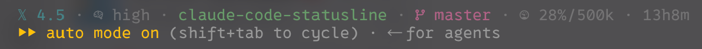

# Claude Code Statusline

English | [中文](./README.zh-CN.md)

A custom [Claude Code](https://code.claude.com/docs/en/statusline) status bar script. Single-line, Starship-inspired layout with Gruvbox Dark colors — works well with third-party / Anthropic-compatible models (DeepSeek, Grok, CPA gateways, and others).



## Quick start

**Requirements:** Claude Code, [`jq`](https://jqlang.github.io/jq/), optional `git`, a [Nerd Font](https://www.nerdfonts.com/) in your terminal.

```sh
# macOS
brew install jq

# Ubuntu/Debian
sudo apt-get install jq
```

```sh
cp statusline.sh ~/.claude/statusline.sh
chmod +x ~/.claude/statusline.sh
```

Add to `~/.claude/settings.json`:

```json
{
  "statusLine": {
    "type": "command",
    "command": "~/.claude/statusline.sh",
    "padding": 0,
    "refreshInterval": 30
  }
}
```

| Setting | Purpose |
|---------|---------|
| `padding` | Extra horizontal spacing. `0` keeps the bar tight. |
| `refreshInterval` | Re-runs the script every **N seconds** (not ms), so duration and git stay fresh while idle. |

Restart Claude Code after changing settings.

## What it shows

| Segment | Example | Source |
|---------|---------|--------|
| Model | `𝕏 4.5` / `🐋 v4 pro` | Short name from `.model.id`, else `display_name` / id |
| Effort | `󰧑 high` | `.effort.level` when present; hidden otherwise |
| Directory | `my-project` | Basename of `.workspace.current_dir` |
| Git | ` master +12 −3` | Branch or detached short SHA; line counts from **real git** (below) |
| Context | `󰡳 15%/500k` | Token usage + context limit (below) |
| Duration | `1h2m` | `.cost.total_duration_ms` |

### Git line counts

```sh
git diff --shortstat            # unstaged
git diff --cached --shortstat   # staged
```

Both are summed. A clean tree after commit **hides** `+N −M`.

These are **not** session-cumulative `cost.total_lines_added` / `total_lines_removed`.

### Context

- **Display:** Nerd Font gauge + `pct%/limit` (e.g. `󰡳 15%/500k`)
- **Used (preferred):** `input_tokens + cache_creation_input_tokens + cache_read_input_tokens`  
  Missing cache fields count as `0`. If token fields are missing, fall back to `used_percentage`.
- **Limit (in order):**
  1. `.context_window.context_window_size` (from Claude Code)
  2. `$CLAUDE_CODE_MAX_CONTEXT_TOKENS` (if Claude Code exports it)
  3. `200000`
- **Gauge tiers** (by used %): `<30` / `30–54` / `55–84` / `≥85`
- **Color** (by remaining tokens): danger / warning thresholds from remaining headroom, not fixed 70%/90% used

The script only **reads** what Claude Code provides (JSON and environment). It does **not** hardcode model → window size maps.

#### Third-party models

Claude Code often treats unrecognized model IDs as a **200k** window. If your provider actually offers more (for example **Grok 4.5** at 500k), set these in Claude Code’s `~/.claude/settings.json` under `env`, then **restart the session**:

```json
{
  "env": {
    "CLAUDE_CODE_MAX_CONTEXT_TOKENS": "500000",
    "CLAUDE_CODE_AUTO_COMPACT_WINDOW": "500000"
  }
}
```

| Variable | Role |
|----------|------|
| `CLAUDE_CODE_MAX_CONTEXT_TOKENS` | Tells Claude Code what context size to assume (feeds `context_window_size` / statusline limit for non-Claude models). |
| `CLAUDE_CODE_AUTO_COMPACT_WINDOW` | Capacity used for **auto-compact** math only; does not replace the statusline limit by itself. |

Requires **Claude Code ≥ 2.1.193** for these env vars to take effect (especially for non-Claude model IDs). Adjust the numbers to match your real model limit. Official reference: [Claude Code environment variables](https://code.claude.com/docs/en/env-vars).

## What it does not show

Built for a compact coding bar — deliberately omitted:

- Token breakdown noise (`input` / `output` / cache hit % as separate chips)
- Client-side cost estimates (often wrong for third-party billing)
- Rate limits (Claude.ai Pro/Max style fields)
- Progress bars and multi-line layouts

## Customization

### Plain model labels

```json
{
  "statusLine": {
    "type": "command",
    "command": "USE_EMOJI_MODEL=0 ~/.claude/statusline.sh"
  }
}
```

| Default | `USE_EMOJI_MODEL=0` |
|---------|---------------------|
| `𝕏 4.5` | `Grok 4.5` |
| `🐋 v4 pro` | `DS v4 pro` |
| `🐋 v4 flash` | `DS v4 flash` |

### Add model short names

Edit the `case "$model_id" in` block in `statusline.sh` (substring match on `.model.id`).

### Colors

Gruvbox Dark via the `C_*` variables at the top of the script (truecolor ANSI).

## Testing

```sh
printf '%s\n' '{
  "model": {"id": "grok-4.5", "display_name": "Grok"},
  "workspace": {"current_dir": "/tmp/demo"},
  "effort": {"level": "high"},
  "cost": {"total_duration_ms": 3720000},
  "context_window": {
    "context_window_size": 500000,
    "current_usage": {
      "input_tokens": 75000,
      "cache_creation_input_tokens": 0,
      "cache_read_input_tokens": 0
    }
  }
}' | ./statusline.sh

bash -n statusline.sh
```

## Troubleshooting

| Symptom | Likely cause |
|---------|----------------|
| Blank bar | Script not executable (`chmod +x`), or workspace trust not accepted |
| Icons are tofu / boxes | Terminal font is not a Nerd Font |
| Context limit looks wrong | Claude Code is reporting that limit in JSON (or defaulting to 200k); fix Claude Code env / model setup, then restart the session |
| `+N −M` after a clean commit | Upgrade the script — counts must come from git shortstat, not session cost fields |
| Duration stuck at `0m` | Set `refreshInterval` (seconds) |
| Context shows `--` | Normal before the first usage payload |
| No git segment | Not a git work tree, or `git` failed (segment is optional) |

## Windows

Details and longer-term options: [ROADMAP.md](./ROADMAP.md).

## License

MIT
