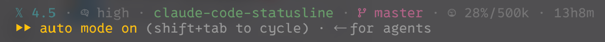

# Claude Code Statusline

English | [中文](./README.zh-CN.md)

A personal Claude Code status bar script with Gruvbox Dark colors. Works with third-party models (DeepSeek, Grok, etc.) and Anthropic-compatible gateways.



## Quick start

**Requirements:** Claude Code, [`jq`](https://jqlang.github.io/jq/), and a [Nerd Font](https://www.nerdfonts.com/) in your terminal. `git` is optional — enables branch name and line-change counts.

**Windows users** should use [Git Bash](https://git-scm.com/download/win), make sure `jq` is on PATH, and pair it with [Windows Terminal](https://aka.ms/terminal) + a Nerd Font. No PowerShell port needed — same script works. More platform notes: [ROADMAP.md](./ROADMAP.md).

### 1. Install jq

```sh
# macOS
brew install jq

# Ubuntu / Debian
sudo apt-get install jq

# Windows
# winget install jqlang.jq
```

### 2. Install the script

```sh
cp statusline.sh ~/.claude/statusline.sh
chmod +x ~/.claude/statusline.sh
```

### 3. Configure Claude Code

`~/.claude/settings.json` (Windows: `%USERPROFILE%\.claude\settings.json`):

```json
{
  "statusLine": {
    "type": "command",
    "command": "~/.claude/statusline.sh",
    "padding": 0,
    "refreshInterval": 30
  }
}
```

Use `~/...` or forward slashes in `command` (e.g. `C:/Users/you/.claude/statusline.sh`). Avoid unescaped backslashes `\`.

| Setting | Description |
|---------|-------------|
| `padding` | Horizontal padding. `0` for compact mode |
| `refreshInterval` | Refresh interval in **seconds**. Duration and git stats only update at this cadence while idle |

Restart Claude Code after changing settings.

## What it shows

| Segment | Example | Source |
|---------|---------|--------|
| Model | `𝕏 4.5` / `🐋 v4 pro` | Gateway-mapped name → `.model.id` short name → `display_name`, detected automatically |
| Effort | `󰧑 high` | `.effort.level` when present; hidden otherwise |
| Directory | `my-project` | Basename of `.workspace.current_dir` |
| Git | ` master +12 −3` | Branch or detached short SHA; line counts from real git |
| Context | `󰡳 15%/500k` | Token usage and limit |
| Usage limits | `󰅐 42% 3h12m  󰃭 18% 4d2h` | `.rate_limits` 5h / 7d windows (claude.ai Pro/Max only) |
| Duration | `1h2m` | `.cost.total_duration_ms` |

Token breakdowns, cost estimates, and progress bars are intentionally omitted to keep the bar compact.

### Git line counts

Working tree (staged + unstaged) against `HEAD`, so a line edited both before and after `git add` counts once:

```sh
git diff HEAD --shortstat
```

Untracked files are not counted. A clean working tree after commit hides `+N −M`. These are **real git numbers** — not the session-cumulative fields `cost.total_lines_added` / `total_lines_removed`.

### Context

Display format: Nerd Font icon + `usage/limit`, e.g. `󰡳 15%/500k`.

**Token usage** (in priority order):
1. `input_tokens + cache_creation_input_tokens + cache_read_input_tokens`
2. Missing cache fields count as `0`
3. Falls back to `used_percentage` when none of the above are available

**Limit** (in priority order):
1. `.context_window.context_window_size` (from Claude Code)
2. `$CLAUDE_CODE_MAX_CONTEXT_TOKENS`
3. Default `200000`

**Gauge tiers** (by usage %): `<30%` / `30–54%` / `55–84%` / `≥85%`

**Colors** are based on remaining tokens rather than fixed 70% / 90% usage thresholds.

The script only reads what Claude Code provides (JSON and environment). It never hardcodes model → window-size maps.

### Usage limits

Shown only when Claude Code reports `.rate_limits` — i.e. signed in with a claude.ai Pro/Max subscription, after the first API response. API keys and third-party gateways never see this segment.

- `󰅐` 5-hour window, `󰃭` weekly window: used % + time until reset (`42m` / `3h12m` / `4d2h`)
- Colors: `≥70%` yellow, `≥90%` red
- Each window hides on its own when missing or past `resets_at`
- Countdowns only advance when the script re-runs; keep `refreshInterval` set

### Third-party models

Claude Code often treats unrecognized model IDs as a **200k** window. If your model supports more (e.g. Grok 4.5 at 500k), configure this in `~/.claude/settings.json` under `env`:

```json
{
  "env": {
    "CLAUDE_CODE_MAX_CONTEXT_TOKENS": "500000",
    "CLAUDE_CODE_AUTO_COMPACT_WINDOW": "500000"
  }
}
```

| Variable | Role |
|----------|------|
| `CLAUDE_CODE_MAX_CONTEXT_TOKENS` | Tells Claude Code the context limit; affects the statusline denominator |
| `CLAUDE_CODE_AUTO_COMPACT_WINDOW` | Auto-compact math only; does not directly change the statusline |

Requires **Claude Code ≥ 2.1.193**. Restart the session after configuring. Reference: [Claude Code environment variables](https://code.claude.com/docs/en/env-vars).

## Customization

### Disable emoji icons

```json
"command": "USE_EMOJI_MODEL=0 ~/.claude/statusline.sh"
```

| Default | `USE_EMOJI_MODEL=0` |
|---------|---------------------|
| `𝕏 4.5` | `Grok 4.5` |
| `🐋 v4 pro` | `DS v4 pro` |
| `🐋 v4 flash` | `DS v4 flash` |

### Add a model

Edit the `case "$model_id|$model_name" in` block in `statusline.sh` — it does substring matching.

### Colors

The `C_*` variables at the top of the script. Gruvbox Dark palette, truecolor ANSI.

## Testing

Verify with mock JSON:

```sh
printf '%s\n' '{
  "model": {"id": "grok-4.5", "display_name": "Grok"},
  "workspace": {"current_dir": "/tmp/demo"},
  "effort": {"level": "high"},
  "cost": {"total_duration_ms": 3720000},
  "context_window": {
    "context_window_size": 500000,
    "current_usage": {
      "input_tokens": 75000,
      "cache_creation_input_tokens": 0,
      "cache_read_input_tokens": 0
    }
  }
}' | ./statusline.sh

# Syntax check
bash -n statusline.sh

# Smoke tests (temp git repos + fixture JSON)
bash tests/run.sh
```

On Windows, write mock paths as `"current_dir": "C:/Users/Public"` (forward slashes).

## Troubleshooting

| Symptom | Likely cause |
|---------|--------------|
| Blank bar | Run `chmod +x`, or accept workspace trust |
| Icons show as tofu / boxes | Terminal font is not a Nerd Font |
| Path broken on Windows | Unescaped backslashes — use `~/...` or `C:/...` |
| `jq: command not found` | `jq` is not on Git Bash's PATH |
| Wrong context limit | Env not set on Claude Code side, or restart needed |
| `+N −M` after a clean commit | Upgrade the script — counts must come from git shortstat |
| Duration stuck at `0m` | `refreshInterval` is not configured |
| Context shows `--` | Normal before the first usage payload arrives |
| No git segment | Not in a git repo, or git command failed |

## License

MIT
